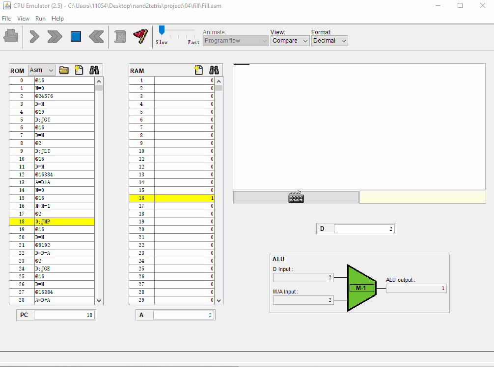
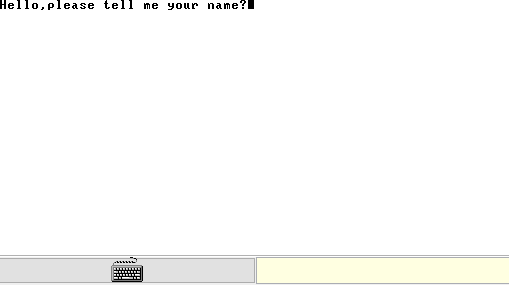
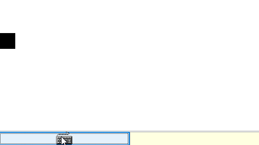

# nand2tetris

> [官网](https://www.nand2tetris.org/ "") [coursera视频](https://www.coursera.org/learn/build-a-computer "") [工具包](https://www.nand2tetris.org/software "") [参考@ReionChan](https://reionchan.github.io/2016/05/28/nand2tetris-zh_CN/ "")

> 该课程让大家了解现代计算机如何从基本门电路开始慢慢被构建。全书以项目为单元，逐一完成这些项目，即可构造出一个16位的Hack计算机硬件，在此硬件之上，开发出汇编编译器、堆栈式虚拟机，针对虚拟机设计出高级编程语言Jack，同时开发出相应的Jack语言编译器。

## 目录

* 硬件体系--> [布尔逻辑](#布尔逻辑) [布尔算术](#布尔算术) [时序逻辑](#时序逻辑) [机器语言](#机器语言) [计算机体系结构](#计算机体系结构)
* 软件体系--> [汇编编译器](#汇编编译器) [虚拟机](#虚拟机-上篇) [JACK编译器](#JACK编译器-上)

### 布尔逻辑

* 基本逻辑门<sup>8</sup>

* 多位<sub>16</sub>基本门<sup>5</sup>

* 多通道逻辑门<sup>6</sup>

### 布尔算术

* 加法器
    * [半加器](./project/02/HalfAdder.hdl "")
    * [全加器](./project/02/FullAdder.hdl "")
* ALU
    * [ALU 16-位算术逻辑单元](./project/02/ALU.hdl "")

### 时序逻辑

* [Bit 1-位寄存器](./project/03/a/Bit.hdl "DFF一个周期的延迟?")
* [Register 16-位寄存器](./project/03/a/Register.hdl "")
* ...
* [PC 计数器](./project/03/a/PC.hdl )

### 机器语言
* [Mult.asm 乘法程序](./project/04/mult/mult.asm)
* [Fill.asm I/O处理程序](./project/04/fill/Fill.asm)

    > 

### 计算机体系结构

* [Memory 内存](./project/05/Memory.hdl)
* [CPU 中央处理器](./project/05/CPU.hdl)
* [Computer 计算机](./project/05/Computer.hdl)

### 汇编编译器

* [无符号的汇编编译器](./project/06/assembler/src/assembler/)
* [汇编编译器](./project/06/assembler/src/assembler2/)
    * [Parser.java](./project/06/assembler/src/assembler2/Parser.java "分词,添加符号表") 语法分析器
    * [Code.java](./project/06/assembler/src/assembler2/Code.java "助记符字典") 汇编语言助记符译码器
    * [SymbolTable.java](./project/06/assembler/src/assembler2/SymbolTable.java "自定义字典") 符号表
    * [Assembler.java](./project/06/assembler/src/assembler2/Assembler.java "主控逻辑") 汇编编译器入口类
* 测试程序
    * ``` java assembler2.Assembler C:\Users\11054\Desktop\nand2tetris\project\06\pong\Pong.asm```

### 虚拟机-上篇

* [VM翻译器](./project/07/VMtranslator/src/vmtranslator2/) 算术逻辑和内存存取
    * [Parser.java](./project/07/VMtranslator/src/vmtranslator2/Parser.java) VM语法分析
    * [CodeWriter.java](./project/07/VMtranslator/src/vmtranslator2/CodeWriter.java ) VM语法--->汇编
    * [VMTranslator.java](./project/07/VMtranslator/src/vmtranslator2/VMTranslator.java) VM翻译入口
* 测试
    * 堆栈运算
    * 内存访问

### 虚拟机-下篇

* [VM翻译器-完整版](./project/08/VMtranslator/src/vmtranslator/)
    * [Parser.java](./project/08/VMtranslator/src/vmtranslator/Parser.java) VM语法分析
    * [CodeWriter.java](./project/08/VMtranslator/src/vmtranslator/CodeWriter.java ) VM语法--->汇编
    * [VMTranslator.java](./project/08/VMtranslator/src/vmtranslator/VMTranslator.java) VM翻译入口

* [测试结果](./project/08/)

### Jack高级语言及程序样例

* [HelloWorld](./project/09/HelloWorld/)

   > 

* [Square](./project/09/Square/) 样例

   > 

### JACK编译器-上

* [Jack语法分析器](./project/10/JackCompiler/src "几乎没有语法纠错")
    * [CompilationEngine.java](./project/10/JackCompiler/src/jackcompiler/CompilationEngine.java "机械操作") 语法分析引擎 
    * [JackTokenizer.java](./project/10/JackCompiler/src/jackcompiler/JackTokenizer.java "提取字符,尤其是粘在一块的") 字元转换器
    * [JackAnalyzer.java](./project/10/JackCompiler/src/jackcompiler/JackAnalyzer.java ) 语法分析器入口

### JACK编译器-下

* [Jack编译器](./project/11/JackCompiler/src/jackcompiler/)
    * [CompilationEngine.java](./project/11/JackCompiler/src/jackcompiler/CompilationEngine.java) 语法分析引擎
    * [JackTokenizer.java](./project/11/JackCompiler/src/jackcompiler/JackTokenizer.java) 字元转换器
    * [SymbolTable.java](./project/11/JackCompiler/src/jackcompiler/SymbolTable.java) 符号表
    * [VMWriter.java](./project/11/JackCompiler/src/jackcompiler/VMWriter.java) VM命令输出器
    * [JackCompiler.java](./project/11/JackCompiler/src/jackcompiler/JackCompiler.java) 编译器入口

* [测试单元](./project/11/)
    * Seven 
    * ConvertToBin 
    * Square [构造方法 方法 成员字段 方法调用]
    * Average [数组和字符串]
    * Pong [静态变量]
    * ComplexArrays [复杂数组引用和表达式]

### 操作系统
* [Math](./project/12/Math.jack)
* [Sys](./project/12/Sys.jack)
